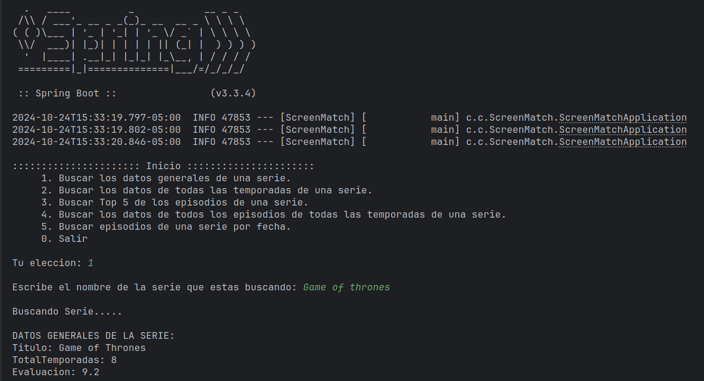

# ScreenMatch 

## Descripcion:
Primer proyecto en Java con Spring Boot del curso de Alura, programa
ONE (Oracle Next Education):

Esta aplicación desarrollada en Java con Spring Boot permite realizar búsquedas 
de series mediante la API de OMDb (https://www.omdbapi.com) para obtener sus datos. 

Con esta herramienta, los usuarios pueden buscar series por nombre, realizar búsquedas por fecha, 
visualizar estadísticas de cada temporada, consultar el top 5 de episodios 
mejor calificados de una serie, entre otras funciones similares. 

Además, se emplean técnicas de programación funcional y se aprovecha la API de Streams de Java, 
permitiendo ejecutar operaciones intermedias y convertir los resultados en 
colecciones específicas para facilitar el filtrado y búsqueda de series.
  

- #### Informacion de todos los episodios de una serie:

## Objetivos:

#### Creacion de proyectos con Spring Initializr:
- Creacion de un proyecto con Spring Boot, agregando Maven como gestor de
dependencias, versiones y metadatos.

#### Consumo de la API de OMDb: 
https://www.omdbapi.com
- Implementación de solicitudes HTTP para interactuar con la API.

#### Estructuras de Datos y Formato JSON: 
- Manejo y procesamiento de datos en formato JSON con la biblioteca Jackson.

#### Introducción a la Programación Funcional en Java: 
- Aplicación de streams para manipular colecciones de datos de manera eficiente.

#### Uso de bibliotecas para manipulacion de datos y calculo de estadisticas:
- DateTimeFormatter
- Optional
- DoubleSummaryStatistics
  

- #### Busqueda de datos de una serie por fecha:

### Tecnologias y herramientas utilizadas:
1. Java como lenguaje de programacion.
2. Maven como gestor de dependencias.
3. Spring Boot.
4. Spring Data
5. Java Persistence API.
6. Hibernate
7. Postman para ejecutar pruebas a la API.
8. Git y GitHub para el control de versiones.
9. API de OMDb para obtener los datos.
10. PostgreSQL como base de datos.
  

- #### Busqueda de un episodio por la primera coincidencia encontrada:

- ### Certificado del curso:

